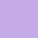

{width="6.270833333333333in"
height="4.947916666666667in"}

1. INTRODUCCIÓN
===============

Como práctica en el curso de lógica y representación III, y además, como
ejercicio para poder aplicar conocimientos relacionados al curso de
lógica y representacioń II, este trabajo nos permite desenvolvernos en
un ambiente de desarrollo y al mismo tiempo a mejorar la capacidad de
poder implementar soluciones a los problemas dados.

Mediante este proyecto, se pudo encontrar un desarrollo involucrado en
GitHub, así como también el desarrollo de páginas web con el uso de
html, css y javascript. Además, se pudo implementar el uso de Atom
(mediante su aplicativo de jsdoc) para poder realizar el manual técnico
de la propia aplicación. De igual manera, se hizo un trabajo en conjunto
con la comunidad de GItHub, mediante repositorios de proyectos que nos
ayudarían más adelante a poder realizar el entorno gráfico del tablero
de juego. Sin embargo, el proyecto quedó diseñado teniendo en cuenta
todas las observaciones hechas en el enunciado de la práctica.

2. FUNCIONALIDADES
==================

En el trabajo, se utilizan diferentes scripts para html que ayudan a la
parte visual, para que sea un entorno más amigable con el usuario, así
mismo para que luzca mejor estéticamente, y sea una página entendible.
Así mismo, se utilizan diferentes comandos ya existentes en html para la
creación de tablas, comboBox, botones, entre otros.

3. ASPECTOS FUNDAMENTALES
=========================

Para el desarrollo del proyecto, el entorno gráfico jugó un papel
fundamental para el funcionamiento del mismo. En el programa, se pensó
en 3 páginas diferentes para cumplir todos los problemas planteados,
estas son: interfaz de inicio (index.html), interfaz de opciones
(opciones.html) e interfaz de juego (jugar.html).

3.1. INTERFAZ DE INICIO
=======================

En este, como su nombre lo dice, se introduce con el nombre del juego,
así como una barra superior en la que aparecen diferentes opciones que
pueden ser utilizadas.

{width="8.024024496937884in"
height="3.4739588801399823in"}

Como se puede apreciar en la imagen, en la parte inicial del index,
aparece una barra con las opciones de “JUGAR”, “CRÉDITOS”,
“INSTRUCCIONES” y “CÓDIGO”. Mediante estas, se pueden ejecutar
diferentes acciones dentro del proyecto. Cuando se presiona la opción de
“CRÉDITOS” se dirigirá a un apartado que se encuentra debajo de esta
presentación. Tal que es así:

{width="6.270833333333333in"
height="1.6944444444444444in"}

En este caso, esta parte es meramente informativa. Tiene la única
función de dar créditos a los creadores del proyecto. Si presionamos
“INSTRUCCIONES”, seremos dirigidos a la parte posterior de la opción
“CRÉDITOS”. En este caso, las instrucciones son presentadas mediante una
tabla que se divide en dos secciones, tal que:

{width="6.270833333333333in"
height="1.3194444444444444in"}

Como podemos ver, se divide en “REGLAS” y “JUEGO”. Cada una de estas son
tablas que representan las instrucciones presentadas en el enunciado de
la práctica. Éstas, contienen los siguientes ítems:
{width="6.270833333333333in"
height="5.555555555555555in"}

{width="6.270833333333333in"
height="4.055555555555555in"}

Como se puede ver, tanto “REGLAS” como “JUEGO” son pestañas meramente
informativas. En este caso, este es el manual de usuario utilizado para
poder explicar el funcionamiento del programa de manera breve, para
hacer del entendimiento del proyecto algo fácil.

Siguiendo con la barra superior, tenemos la opción “CÓDIGO”. En este
caso, ésta nos abrirá la página de GitHub donde está el proyecto. En
este caso, tenemos las carpetas en donde se encuentra todo el programa.
Además, también se puede encontrar el markdown donde estará la
presentación formal del proyecto, así como los repositorios que fueron
de ayuda.

3.2. INTERFAZ DE OPCIONES
=========================

Finalmente, en la parte superior del index, tenemos la opción de
“JUGAR”. En este caso, se nos presentará una interfaz donde se podrá
decidir la generación del tablero al gusto del jugador. La presentación,
en este caso, se compone de la siguiente manera:

{width="6.270833333333333in"
height="4.152777777777778in"}

Como se puede observar, existe la posibilidad de elegir porcentaje tanto
de serpientes como escaleras, así como el tamaño del tablero y del modo
de juego. En este caso, los porcentajes tanto de escaleras como
serpientes, van hasta un máximo de 10% (sumando, en total, un máximo de
20% por ambos).

{width="2.097843394575678in"
height="3.0989588801399823in"}
{width="2.211498250218723in"
height="3.119792213473316in"}

Así mismo, la modalidad y el tamaño del tablero, fueron de selección
múltiple con única opción, como se puede tal que queda de la siguiente
manera:

{width="2.182292213473316in"
height="3.010057961504812in"}
{width="2.1894903762029747in"
height="3.026042213473316in"}

En la parte superior de la pantalla de esta interfaz, se tienen una
opción, la cual es “VOLVER”. Como su nombre lo indica, su función es
volverse a la página principal (index.html).

3.3. INTERFAZ DE JUEGO
======================

Esta interfaz, será especialmente diseñada por la de opciones. En esta,
se mostrará el tablero, los jugadores (con su respectivo color) y se
mostrará el dado que ha sacado al momento de lanzar.

{width="6.270833333333333in"
height="3.4583333333333335in"}

En este caso, la screenshot nos muestra que el tablero generado fue uno
de tamaño 8x8, con un porcentaje de 10% en total, con 5% de escaleras y
5% de serpientes. El tablero por su parte, tiene incluído líneas rojas,
que representan serpientes, y líneas verdes que representan escaleras.
Además, contiene una bola de determinado color, que representa uno u
otro jugador. También, muestra la baldosa de inicio (color verde) y la
baldosa de fin (color rojo).

También, podemos observar que en cada botón, aparece el color del
jugador, así como el dado que obtuvo. Estos colores y dados están dados
de la siguiente manera:

{width="0.3958333333333333in"
height="0.3958333333333333in"}
{width="0.3958333333333333in"
height="0.3958333333333333in"}
{width="0.3958333333333333in"
height="0.3958333333333333in"}
{width="0.3958333333333333in"
height="0.3958333333333333in"}
{width="0.3958333333333333in"
height="0.3958333333333333in"}
{width="0.3958333333333333in"
height="0.3958333333333333in"}

{width="0.4010422134733158in"
height="0.3958333333333333in"}
{width="0.3958333333333333in"
height="0.3958333333333333in"}

Cuando un jugador obtiene el 6, podrá lanzar una segunda vez, y así de
manera sucesiva (N+1 lanzamientos cuando tiene N número de seis).

{width="3.7291666666666665in"
height="0.6458333333333334in"}

Cuando el programa capture a un jugador en la posición final, mostrará
una alerta diciendo que este ha ganado el juego. Posterior a esto, se
volverá a la página de opciones.

{width="4.40625in" height="1.2604166666666667in"}

En el caso de la modalidad de 1VBOT, el jugador iniciará la partida
lanzando su dado.

{width="4.229166666666667in"
height="1.3229166666666667in"}

Cuando se presione el dado, y salga el resultado, seguirá el turno del
bot. Este, estará programado mediante tiempo, y se hará de manera
automática. El dado del bot será removido una vez el jugador lance el
dado de nuevo. El turno para el jugador será concebido una vez el bot
avance.

{width="3.71875in" height="1.3541666666666667in"}

En la parte superior de la interfaz de juego, tenemos dos opciones:
“VOLVER” y “GUARDAR”. En el caso de “VOLVER”, será de ayuda para
regresar a la página de opciones, por si nos hemos equivocado
seleccionando alguna opción previamente. En el caso de “GUARDAR”, se
tendrá la opción de, como su nombre lo dice, guardar mediante una
descarga el tablero generado.

{width="6.270833333333333in"
height="3.3055555555555554in"}

Ésta por ejemplo, es la descarga que genera el botón “GUARDAR”, del
tablero de juego. Como se puede notar, sólo hace aparición el tablero de
juego (puesto que es un requisito de la práctica), por lo que no se
mirarán ninguna ficha, así como ningún dado o color de figura.

4. EXCEPCIONES
==============

Para las excepciones, se trabajó sobre todo en el ámbito de la interfaz de juego, ya que estas son:
===================================================================================================

-   ¿El jugador 1 ganó?

-   ¿El jugador 2 ganó?

-   ¿El bot ganó?

-   ¿Es el resultado del dado igual a 6?

-   ¿La serpiente está generada en el final?

-   ¿Es el turno del jugador 1?

-   ¿Es el turno del jugador 2?

-   ¿Es el turno del bot?

-   ¿Hay dos escaleras en el mismo inicio?

-   ¿Hay dos serpientes en el mismo fin?

-   ¿Es mayor el resultado que las casillas faltantes?

-   ¿Es la posición actual una escalera?

-   ¿Es la posición actual una serpiente?
